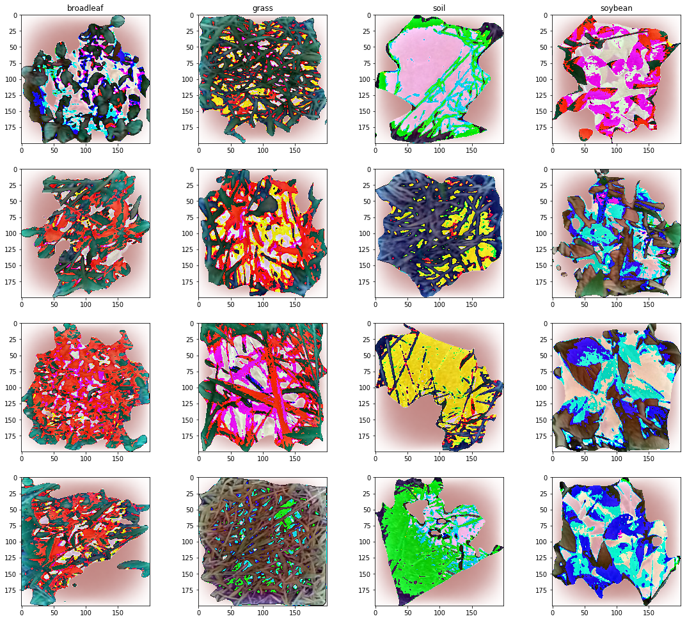
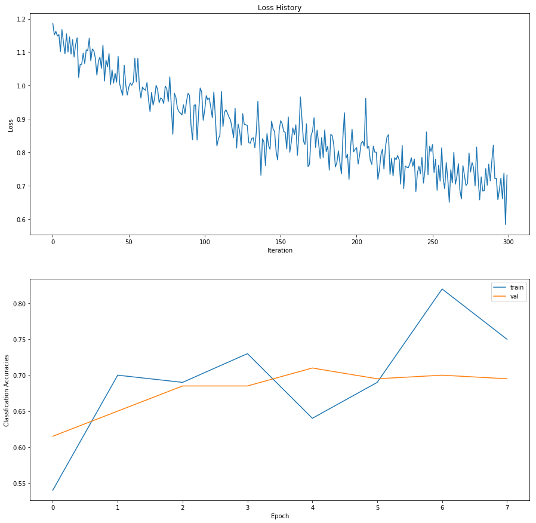
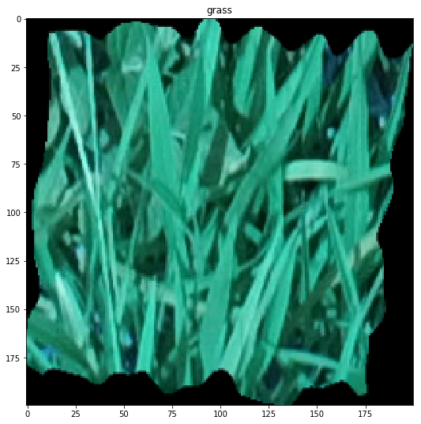
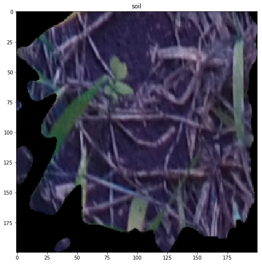
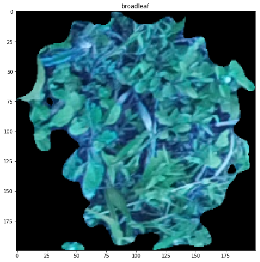
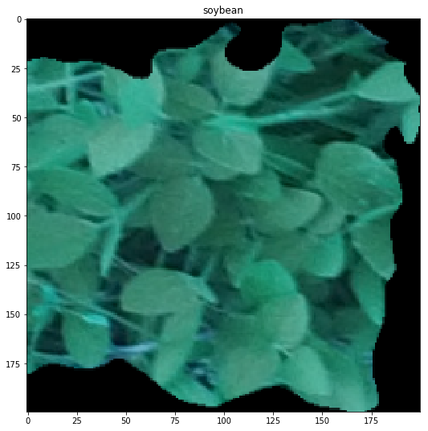

# Weed-Detection-in-Soyabean
Weed detection in Soybean crops using 2-layer neural network.

Link to the notebook in nbviewer

https://nbviewer.jupyter.org/github/jayant2014/Weed-Detection-in-Soyabean/blob/master/Weed%20Discriminant%20in%20Soyabeen%20Dataset.ipynb

## Screenshots

## Visualization

## Loss History 300

## Grass Prediction

## Soil Prediction

## Broadleaf Prediction

## Soybean Prediction

